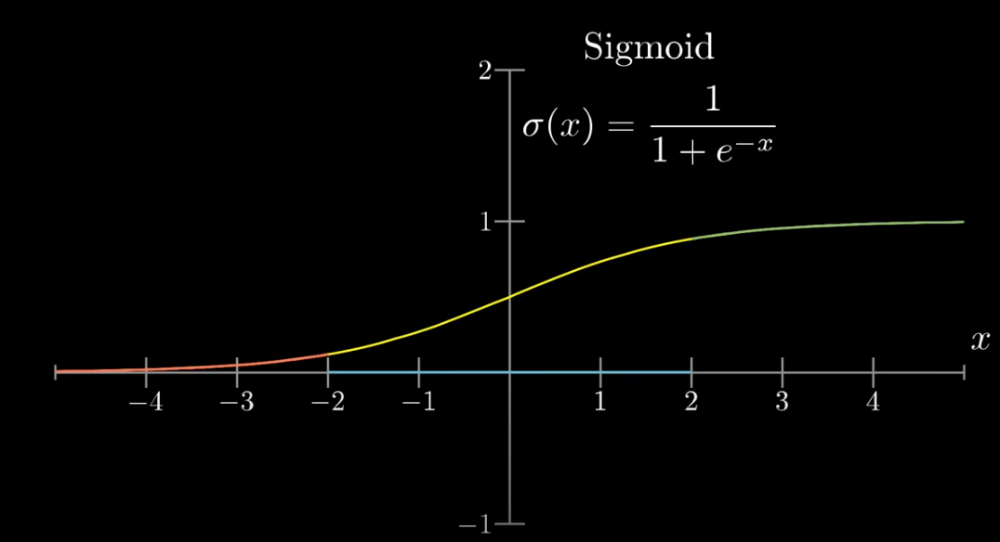
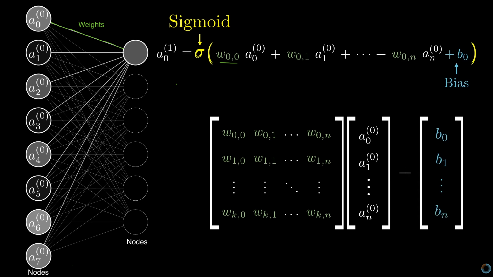
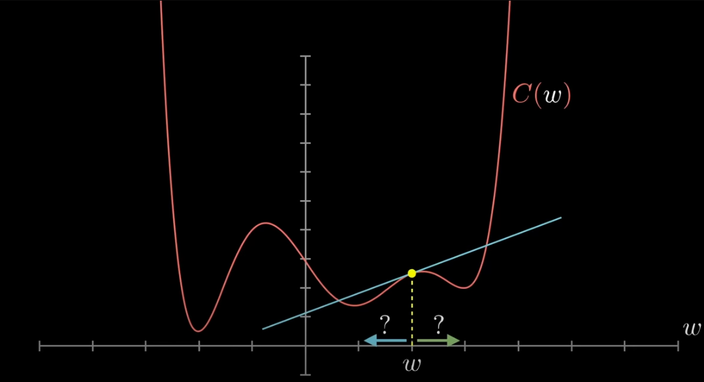
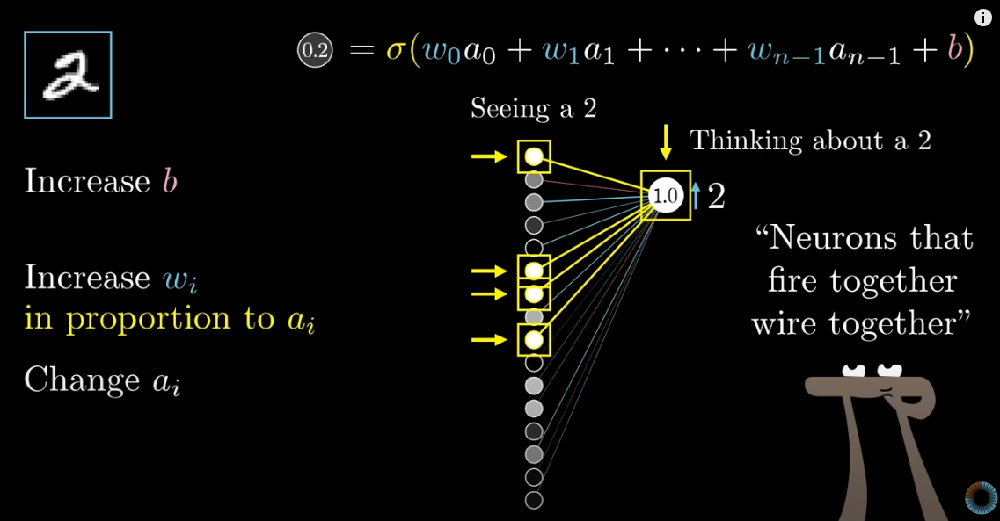

# Deep Learning Basics

This notebook covers the basics on deep learning and how neural networks work. This is a learning resource, not a practitioners guide. All material is drawn from the 3Blue1Brown YoutTube Series on Deep Learning (Videos 1-3). 

Author: Mary Catherine Sullivan

## What Is A Neural Network

Each node is a neuron and each neuron holds a number ("activation")

Suppose we have an image with a size of 788 (784 pixels) -- this space is the first layer

The final layer is your model output/prediction

The layers in between are the "hidden layers"

Nodes from one layer connect to the next. Each node in the first layer, for example, has some weight by which it is connected to a node in the following layer, so a node in the second layer is the weighted sum of the previous nodes. 

We want nodes in the second layer to be between 0 and 1 so we use Sigmoid function (logistic curve) to calculate the activation in a node in the second layer. 

We don't neccessarily want to active a node if the weighted sum is strictly greater than 0 -- we want some bias for inactivity -- so we add some bias to this function to allow for this. 

So each neuron is a function that takes values from the previous layer and spits out a number

## Learning = Finding The Right Weights and Biases**

So each neruon is connected to all neruons in the previous layer, the weights in the weighted sum are the strength of the connection between neurons in successive layers, and the bias is some indication of if that neuron is generally active or inactive.

To begin training we totally randomize all weights and biases . . . which will be do an awful.

So we define a "cost" function to tell the computer how wrong it is for each training example. The cost in the average of all the differences between the prediction (the value the nodes in our final layer spit out) and the truth of all our training example, and the computers goal is then to select the weights and biases that minimize this cost function -- remember calculus!

Problem is that our neural network has thousands (or millions) of inputs, so there will be lots of local minimum. The computer is going to take slope of the current location on the loss function and move either to the right or left depending on if the slope is positive (right) or negative (left) to find some local minimum.

In multi-variate calculus the gradient of a function tells you the direction of the steepest increase -- basically what direction do I need to shift my weights to see the greatest increase in the cost function. So we take the negative graident to find the direction of the steepest decline, take a small step in that direction (a gradient step) and repeat that process until we find a local minimum. This process is called negative graident descent.

In short, a neural network is determining what nudge in numbers is going to make the largest impact on the cost -- which recall is the _average_ of all training examples. 

This will increase weights for nodes that are more predictive of the final result (which input values gives you more bang for your buck to minimize the cost function).

In practice, we are dealing with thousands or millions of weights and biases we are trying to select to minimize our cost function -- which is beyond the scope of our imagination. It is helpful to think of the magnitude of each weight and bias as how sensitive the cost function is to each weight and bias.

The cool thing about Neural Networks is it will determine on it's what inputs are useful for predicting the output (the hidden layers) -- where as when we think of regression analysis we are determining what the independent variables. This is often why Neural Networks are called black boxes -- what the computer decides nodes "represent" in the hidden layer are not human identifiable patterns or features. 

## Backpropagation

How we adjust the weights and biases for each gradient step depends on all the weights and biases for all training examples. At each step the network can update:

1. The bias
2. The weights
3. Change the activation from the previous layer (recall the activation value from the previous layer is determined by the weights and biases of that layer's previous layer)

**"Neurons That Wire Together Fire Together"**

The biggest increase to weights happens between neurons that are active together and that we wish to become more active. So if we think about the example neural network to identify numbers from images, the nuerons that fire when seeing a two should be more strongly linked when thinking about (or predicting) a two.

So if think about the second to last layer of our network, if the network increased the weights on all nodes activated when predicting a two and decreased the weights on all nodes not activated when predicting a two, then the network would do a better job predicting a two. 

But we are doing this process for all possible predictions -- so we have to consider what nodes each training example wants to be active and the activation of the final layer depends on the weights and biases of the previous layer. So then we go back and see what weights and biases determine the activation of the final layer and optimize those, we repeat this process going backwards through the network. This is backpropagation.

Backpropagation is the algorithim used to determine how a single training example would like to nudge the weights and biases across the entire neural network.

So for each training example we move backwards through our network considering how that example would like to update the weights and biases of each layer to minimize its cost. 

We then average together all those desired changes which gives us, losely speaking, is the negative griadent of the cost function. 

In theory each step takes a long time if we adding up the influence of all training examples for each griadent step, but this is computationally slow. Instead, we typically shuffle our training data and divide our examples into mini-batches. Then we compute the gradient descent step for each batch using backpropagation, called stochastic gradient descent. 

A good analogy for this is using mini-batches is akin to a drunkards walk to the minimum, it's going to be a bit more chaotic walk of a bunch of quick steps, compared to careful slow walk with the exact optimal direction to reach the minimum. 

By now, you should be thinking about how your batch size and unbalenced classes might influence a network's ability to find a local minimum.

To do this we need A LOT of training data.

## A Quick Aside On Deep Learning and Machine Learning

Machine learning is any model where we use data to determine how a model behaves. In all machine learning we have some input data, some desired output, and some tunable parameters we want a model to learn to achieve our desired output. Linear regression does this with a small number input parameters where it determines the relative weight to each parameter to produce a prediction. GPT-3 does the same, but it uses 175,181,291,520 parameters.

Deep learning is a class of models that use the same training algorithim, backpropagation. Deep learning models include multilater perceptrons, convolutional neural networks, and transformers. 

All deep learning models require input data to be an array of real numbers -- this could be a one-dimensional, two-dimensional, or a multi-dimensional array usually called a tensor. These arrays are transformed throughout each layer until we get to a final array which provides are output. Deep learning is at its core, matrix algebra.

## Helpful References
* [3Blue1Brown YoutTube Series on Deep Learning (Videos 1-3)](https://www.youtube.com/watch?v=aircAruvnKk&t=3s)
* [Free Online Book On Deep Learning](http://neuralnetworksanddeeplearning.com/)
* [Good Blog On Neural Networks](https://colah.github.io/)