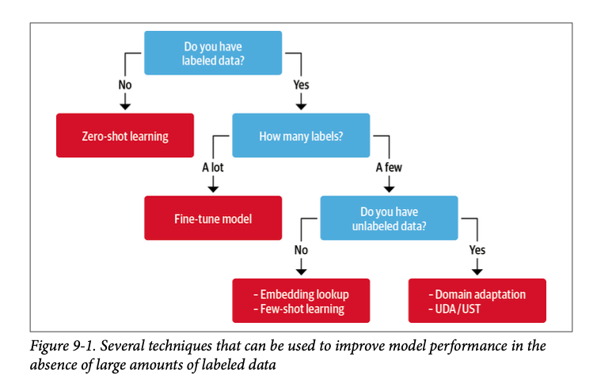
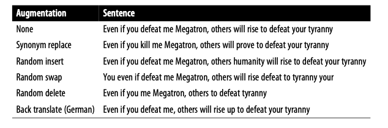

# Using Transformers For Natural Language Processing

The purpose of this notebook is to provide a practical overview for training transformer models. There is no code, but material assumes you will be training your models using Python, Hugging Face, and PyTorch. 

Before reading this please read both the Deep Learning and Transformers Guides for background. The example notebooks folder contains code examples for many of these concepts. 

Author: Mary Catherine Sullivan

1. [Traning Transformers](#TraningTransformers)
2. [Training Parameters](#Parameters)
2. [Dealing With Data](#Data)
2. [Evaluating Performance](#Performance)
2. [Active Learning](#ActiveLearning)
3. [Making Models Smaller and Faster](#ModelSmaller)
4. [Helpful Resources](#HelpfulResources)

## Training Transformers[^1] 
[^1]:(Natural Language Processing with Transformers, Chapter 1)

As we covered in the Transformers Guide, transformers are a type of neural network orignally designed for NLP.

Transformers consistent of two stages: the **Encoder** and the **Decoder**. The encoder is responsible for taking our data and encoding it into a numerical representation (embeddings). This state is then passed to the decoder, which generates the output (recall dot products and softmax). The encoder and decoder can be any kind of neural network architecture.

The problem with training a transformer from scratch is it's computationally expensive (both in terms of money, time, training data, and computational power). So instead we use **Transfer Learning** to fine-tune transformer model for a specific task. This involves splitting the model into a *body* and a *head* where the head is a task-specific neural network. During training, the weights of the body (which are initially taken from our pre-trained model) are updated on our own data and these weights are used to inialize a new model for the new task. 

Transfer learning is composed of three main steps:
1. **Pretraining**: The initial language modeling where we train a transformer to learn word embeddings by having it predict the next word in sequence of text (GPT) or predict a random missing word within the text (BERT) using no labelled data
2. **Domain Adaption**: Take a pretrained model and adapt it to your specific corpus, we are still using langauge modeling but we are using those inital weights from the pretrained model and then updating those weights (the model body) using data from our corpus
3. **Fine-Tuning**: We fine-tune a classification layer (the model head) for the target task (like classification)

You will find all publically available pretrained models to download and fine-tune on Huggingface, but Tensorflow and PyTorch also have hubs with available models worth checking out. 

### Selecting A Pretrained Model

Most transformer models are generally one of three types:
1. Encoder-Only: These models convert text into numerical representations for task like text classification or named entity recongition and use bidirectional attention (using tokens from both the left and right of the target token). Examples include BERT & RoBERTa. 
2. Decoder-Only: These models will complete text using next word prediction and tend to use causal or autoregressive attention (only looking at tokens appearing before the target token). Examples include GPT. 
3. Encoder-Decoder: Thse models use complex mappings from one sequence of text to the next for machine translation or summarization. Examples include BART & T5.

| Type | Model | Notes[^3] |
| :------ | :------  | :----------  |
|Encoder | BERT | The original encoder model |
|| DistilBERT | A distilled (smaller) version of BERT |
| | RoBERTa | Continued training BERT with a modifying pretraining scheme, droped the NSP task, and trained for longer, with larger batch sizes, and with more data. Better performance than BERT |
| | ALBERT | Updated some changes to the encoder architecture for efficiency. Changes the NSP tasks to a sentence-ordering tasks. Makes it possible to run larger models with fewer parameters with better performance on natural language understanding tasks |
| | ELECTRA | Uses a two-model approach where the model has to both predict the masked word and also predict which token from the first model was orginally masked.|
| | DeBERTa| Adds architecture to better take into account the position of a token within a text. This is the first model to beat the humanbaseline on the SuperGLUE benchmarch.|

[^3]: See more on page 106 in Natural Language Processing with Transformers.

Some Quick Notes on Selecting Models:
* Models beginning with "Distil" are distilled (smaller) versions of larger models that achieve similar performance. 
* Models that start with XLM are trained on multi-lingual data
* In Hugging Face a "checkpoint" refers to the set weights that are loaded into a given transformer architecture 

### Tokenization 

The first step is **tokenization**, the process of splitting your text into tokens. Transformers use subword tokenization, so a single word can be one token or multiple tokens. This allows the model to deal with complex, rare, or misspelled words as well as keep frequent words as uniqiue entities. How text is tokenized is inherited from our pre-trained model.

Before tokenizing we want to do some normalization to our text like stripping white space, removing accents, and possibly making lowercase. We standardize this step within Eisenhower.

As the text is tokenized, each token is assigned a unique interger (`input_ids`). When we use a tokenizer from a pre-trained model is add other specials characters to represent the text such as `[CLS]` for the start of sequence and `[SEP]`: end of sequence. Different tokenizer use different special tokens.

If your text is shorter than the longest text in the batch, we pad the text with 0s so all input lengths are the same size. Conversly, if you have text that is larger the model's maximum context size then you will need truncate that text. 

### Model Heads

Next, these token encodings are converted to token embeddings and are passed through the encoder block layers to yield a hidden state for each input token. For language modeling, the hidden state (or final updated embeddings) are passed to a layer that predicts the masked input token. For classification, we replace the masked language modeling layer with a classification layer. 

There are two ways to train a text classification transformer model[^2]: 
[^2]:(See Natural Language Processing with Transformers, Chapter 2)
1. transformers as features: use the hidden states as features and just train a classifier on them without modifying the pretrained model
2. fine-tuning transformers: Train the whole model end-to-end, which also updates the parameteres of the pre-trained model 

To use a transformer as a feature extractor we freeze the body's weights during training and use the hidden state as features for the classifier. The classifier can be a neural classification layer, logisitic regression model, or a random forest model. The advantage here is you can quickly train a small model. 

That being said, fine-tuning will yeild better results. When fine-tuning we are updating the model weights (and thus the final hidden layer) to our data and then adding a differentiable classification head. See more in Training Parameters section. 

## Training Parameters 

Recall that in the **Stochastic Gradient Descent (SGD)** the algorithm is taking the slope of the cost function and finding the negative graident of the steepest decline and moving a small step in that direction until we find a local minimum. Doing this for all of our training data at once is computationally slow, so we usually divide our data into mini-batches. Most of key training parameters relate to how this algorithm is implmented during training.

**Batch Size**: SGD hyperparameter that controls the number of training samples to work through before the model’s internal parameters are updated. A batch size of 1 mean the model’s internal parameters will update for every 1 sample it sees. For mini-batch gradient descent popular batch sizes include 32, 64, and 128 samples. 

* Batch Gradient Descent: Batch Size = Size of Training Set
* Stochastic Gradient Descent: Batch Size = 1
* Mini-Batch Gradient Descent: 1 < Batch Size < Size of Training Set

**Epoch**: SGD hyperparameter that controls the number of complete passes through the training dataset. One epoch means that each sample in the training dataset has had an opportunity to update the internal model parameters. An epoch is comprised of one or more batches. The number of epochs is usually quite large, usually hundreds or thousands. Transformers trainer `num_train_epochs` defaults to 3. Too few epochs and model will be underfit, to many and it will be overfit. 

**Step**: A step is one gradient update. SGD takes one batch, trains the models, updates the model’s internal parameters – this is one training step (sometimes called an iteration). So if you have 2,000 samples and a batch size of 10 (2,000 samples / 10  = 200 steps per Epoch). 

* During one epoch: # of steps = # of batches = # of gradient updates

**Learning Rate** : The learning rate is the amount that the weights are updated during the SGD. Specifically, the learning rate is a configurable hyperparameter used in the training of neural networks that has a small positive value, often in the range between 0.0 and 1.0. The learning rate controls how quickly the model is adapted to the problem. Smaller learning rates require more training epochs given the smaller changes made to the weights each update, whereas larger learning rates result in rapid changes and require fewer training epochs. The learning rate is often the most important hyperparameter for a model. Transformers trainer defaults to $5e^{-5} (.00005)$.

Fun aside: The `BertViz` package allows users to visualze the weights across layers of your neural network. 

## Dealing With Data 

### What To Do If You Don't Have Enough Data

Here is what happens: client teams wants fancy model to classify some text (or whatever), they want it fast, they want it to be accurate, but they either don't want to, are bad at, or don't have time to label data for you. This section will cover some methods to overcome the ever-presence lack of data problem. 

#### Zero Shot Learning

If you have no labelled data and no time to gather some, you can use a zero shot learning model. One approach is to use a "fill-mask" model trained to predict a masked token in text (models like BERT). You can use pass these models the text, the prompt `"this text is about [MASK]"`, and ideally if you have an idea about what your labels should be a list of targets `['finance', 'politics', 'healthcare']`. 

Using a masked language model for classification is a nice trick and works in pinch, but we can do better by using a model that has been trained on a task that is closer to text classification. **Text entailment** is a natural language inference (NLI) model designed to determine whether two passages are likely to follow or contradict each other. These models are usually trained on the Multi-Genre NLI Corpus or the Cross-Lingual NLI Corpus. In NLI models the model recieves a premise, `"The house was recently built`, and a hypothesis, `"The house is new"`, and assigns either neutral, contradicton, or entailment. The idea here is you change the hypothesis to your zero-shot prompt `"this example is about {label}"` and the entailment score tells you how likely that premise is to be about that topic. The built in zer-shot-classification on Huggingface uses this approach. 

A couple things to keep in mind: 
1. Zero-shot models are trained on a genral language training set so the further your domain is from the original training set the worse the model will perform on your data. 
2. These models are _very_ sensitive to the names of the label (think back to the Transformers Guide). If your labels are too complicated or are not easily connected to the text the model will perform poorly -- think back to how transformers update embeddings from the Transformers guide. If a model trained on a general language data set wouldn't think two words have close embeddings then it won't predict a label for that text. It's always a good idea to play around with different labels or try using multiple labels for the same target topic to achieve the best results.
3. You can also update the hypothesis, the default in Hugging Face is `"this example is about {label}"`, but changing this might improve performance. 

#### Data Augmentation

If you have some training data you can use data augmentation techniques to generate new training examples from existing ones. This is easier in computer vision, but tricker in NLP. Changing one word in a text can drastically change it's meaning, so we want to be careful. However, if our training data is more than a few sentences then noise introduced by augmenting our data should not affect the overall label. There are two ways to do this:

**Back translation** is when you translate the source text into one or more target languages using machine translation and then translate it back to it's original source language. This approach works best when your data doesn't contain too many domain-specific words.

**Token perturbations** is when you randomly perform simple transformations like random synonyn replacement, word insertion, swap, and/or deletion. Libraries like `NlpAug` and `TextAttack` can help implement this. 

#### Use Embeddings As A Lookup Table

Large language models like GPT are good at learning useful representations of text that encode information across many dimensions. We can use embeddings of large language models to develop a semantic search engine to find similar documents or even classify text. This generally involves three steps:  

1. Use language model to embed all labelled text
2. Perform a nearest neighbor search over the stored embeddings for our new unlabelled text
3. Aggregate the labels of the nearest neighbors to get a prediction

The beauty of this approach is that no model fine-tuning is necessary to leverage the few available labeled data points. Instead, the main decision is selecting an appropriate model that is ideally pretrained on a similar domain to your dataset. In the flow chart above this is a recomendation for cases where we have some labelled data, but no unlabeleld data. This works for those cases (which are exceedly rare in our work), but is mentioned as an approach to assign unseen data to clustered data in which there is no explicit label such as online topic modeling. 

#### In-Context and Few-Shot Learning

**in-context** or **few-shot-learning** is a middle ground between zero-shot learning where we can't take advantage of any training data and fine-tuning a task-specific head and tuning the model parameters to our data. The team behind GPT-3 found that model performance was greatly improved if you provided a few examples in the prompt. A new approach called `ADAPET` has particulary high performance, see Hugging Face's `setfit'

#### Domain Adaption

While have a ton of labelled data is the best-case scenario, having some labelled data and a ton of unlballed data is the next best thing (and usually the scenario we find ourselves in). In transfer learning, we use a pretrained model we can leverage the pretrained weights for other tasks on our domain specific data. If the downsteam task has a similar textual structure as the pretraining texts, the transfer works better. This is where domain adaption comes in. Basically we are going to adapt the model body to our domain before training the classification head. Another benefit of domain adaption is that adopted model can be reused for many downstream task. 

To do this we fine-tune a pretrained model with masked language modeling on the unlabelled portion of our dataset. So your unlabelled data `"transformers are awesome!"` becomes `"transformers are [MASK]!` -- the transformers package has a built in function to randomly mask some percentage of tokens in your unlabelled data. Domain adaption can provide a boost to model performance with little effort -- and the more unlabelled data and the less labeled data you have, the more impact you will see from this method. Unless you truly have a ton of training data, this is good standard practice.

### Unbalenced Datasets 

One challenge with text classification is working with unbalenced datasets. See the [Imbalanced-learn package](https://imbalanced-learn.org/stable/) for more techniques, but a few options include:  
1. Randomly oversample the minority class
2. Randomly undersample the majority class
3. Get more data from the underrepresented classes

Another challenge with unbalenced datasets, that is also a challenge with multi-label datasets, is creating a training set with balenced classes. The `Scikit-multilearn` library is helpful for creating balenced training sets.

## Evaluating Performance 

### Evaluation Metrics

**Loss**: Recall that graident descent algorithim is trying to minimize the cost function (also called loss function). The loss function reduces all the errors between your predictions and correct labels into a single number, and _the lower the number the better your model performance_. Typically in neural network we use cross-entropy loss (for regression we use mean squared error as a point of comparison), for complex problems you can also select a different cost funtion but cross-entropy is the standard default.

| | Prediction: Positive |Prediction: Negative |
| ---- | ---- | ---- |
| **Actual: Positive** | True Positive | False Negative |
| **Actual: Negative** | False Positive | True Negative |

**Accuracy**: Total of correct predictions divided by the total number of samples. Accuracy answers: Out of all the predictions we made how many were true?

$ Accuracy = {TP+TN \over TP +TN + FP + FN} $

**Percision**: The proportion of true predictions that were correctly classified. Percision answers the question: Out of all the positive predictions we made how many were correct?

$ Percision = {TP \over TP + FP} $

**Recall**: Recall is the true positive rate and tells us how good the model is at finding all the positives. Recall answers the question: Out of all the data points that should be predicted as positive, how many did we correctly predict as positive?

$ Recall = {TP \over TP + FN} $

**F1**: F1 scores combine recall and precision, since there is trade-off between precision and recall this score takes the harmonic mean of both measures.

$ F_1 = {Precision \times Recall \over Percision + Recall} $

How these metrics are different for multi-class (more than two labels but labels are mutually exclusive) or multi-label (more than two labels but labels are not mutually exclusive) classification problems, but the initution is the same. When creating your evaluation loop just be sure to use the correct formula for metrics depending on your problem. 

### Base-Line Models 
One way approach to evaluating transformer models (and deciding if you need one in the first place) for classification problems is to first train a baseline model to get a sense of what baseline accuracy is and how much additional performance a transformer model provides. There are two approaches.

First, Scikit-learn has a `DummyClassifier` that can be used to build a dummy classifier that always picks the majority class or randomly selects a class to give you a base-line accuracy to compare to. This is a quick and dirty way to see what additional performance any models provides and can be particularly handy for unbalenced classes where selecting the majority class might lead to better overall accuracy. 

Second, you can train a naive bayes classifier using Scikit learn. Doing this allows us to see if a baseline model where we use regular expressions or bag-of-words to predict classes actually suits our use case. There is no need to waste computing resources if your problem doesn't require it. In addition, this gives you a good gut check for if our transformer is working as intended. If a simple classifier gets 80\% accuracy and our transformer gets 60\% accuracy we likely need to debug our model. 

### Identify Where The Model Stuggles
For classification tasks, after we train a transformer you can return the model loss for each sample in your test/validation set. This enables you to see where ground truth labels might be wrong and where the model has the hardest time assigning predictions. Annotators sometmes mislabel things or maybe there are samples without a clear class; looking at predictions with the highest loss can give you insight into where you model is stuggling and why. Conversely, we can also see where the model is the most confident by looking at samples with the lowest loss. This is wise to ensure the model is not overfitting to your text or improperly exploit certain features to make its predictions.[^4] 

[^4]: (See Natural Language Processing with Transformers on P.51)

## Active Learning 

More to come! 

## Making Models Smaller and Faster 

### Knowledge Distillation For Fine-Tuning
**Knowledge Distillation** is a method that transfers knowledge from a larger teacher model to a smaller student model to reduce computational and memory cost. The basic idea is you augment your training set with a distribution of soft probabilities (obtained via softmax with a higher value of $T$) from the teacher model, which provide complemetary information for the student to learn from. During distillation the student tries mimics these probabilities, transferring knowledge from the teacher model's hidden layers that is not available from the labels alone. Knowledge distillation can also be used during pre-training to create a general-purpose student model that can be further trained on downstream tasks (i.e. DistilBERT).

A general rule of thumb: your student and teach models should be of the same model type. You don't want a BERT teacher model and a RoBERTa teacher model (these models have different embeddings spaces so it will be harder for the student to mimic the teacher). A good idea is to use a full model like BERT as the teacher and it's distilled version as the student. 

Knowledge distillation introduces new training parameters $\alpha$ and $T$. $\alpha$ controls the relative weight of the distillation loss (how much signal should student get from teacher), higher $\alpha$ is less signal. $T$ controls how much uniform the probability distribution is in the softmax function, higher $T$ is more uniform. 

Distilled models are smaller and faster, but usually come with some performance loss. If your performance loss is very minimal this a good technique to speed up inference and reduce storage cost.

### Quantization 

Rather than reduce the number of computations the model needs to make, **Quantization** makes computation more efficient by representing weights and activations (the value of your nodes in your network) with low-precision data types like 8-bit integer instead of the usual 32-bit floating point. Reducing the number of bits means the resulting models needs less memory storage and operations like matric multiplication can be done much faster. These performance games typically come with little to no loss in accuracy.

First, a quick nots on ways we store numbers in computers. A 32-bit floating-point number represents a sequence of 32 bits that are grouped in terms of sign, exponent, and significand. so $137.035$ can be written as a floating point with $1.37035 \times 10^2$. A fixed-point format represents numbers as a B-bit interger that are scaled by a common factor for all variables of the same type. For example, $137.035$ can be represted by the interger $137,035$ that is scaled by $1/1,000$. We can further contrl the range and precision of a fixed-point number by adjusting the scaling factor. 

Once a model is trained we only need the forward pass to run interference, so we can reduce the precision of how our data is stored to speed things up. Transformers are good candidates for quantization because weights and activations tend to take values that are in relatively small ranges -- for instance most weights will be in a range from -1 to 1.

Since 8-bit integers have four times fewer bits than 32-bit floating-point, computation is both faster and requires less computation. There is a catch: quantization introduces small disturbances at each point in the model's computational graph which can affect model performance. There are several ways to quantize a model:

1. In **dynamic quantization** nothing is changed during the training and the adaptions to weights and activations are only performed during interference. This is the simpliest approach, but the weights and activations are read to memory in floating-point format so the conversion between interger and floating point can cause a performance bottleneck.
2. In **static quantization** instead of computing the quantization of activations of the fly, we can avoid conversions by preocmputing the quantization scheme. Quantization is done ahead of inference time and the ideal conversion is calculated and saved. However, it requires access to a good data samle and introduces an additional step in your training pipeline. In addition this approach does not account for the discrepancy between the precision during training and inferences, which leads to a performance drop.
3. In **quantization-aware training** the effect of quantization can be simulated during training by "fake" quantization of the FP32 values by rounding FP32 values to mimic the effect. This is done both during the forward and backward pass and improves performance over both static and dynamic quantization. 

In NLP dynamic quantization is currently the best approach. 

### ONNX

ONNX is an file format for saving deep learning models, basically it exports your neural network as a computational graph. One benefit of this file type is you can train a model in PyTorch and then export it to Tensorflow. The primary benefit is that **ONNX Runtime** allows you to run models on different types of hardware. All in all, exporting your models in ONNX reduces the model size and increases inference time.

### Weight Pruning

Recall that nuerons in our network are connected by weights, which determine what nuerons are active. The main idea behind weight pruning is to gradually remove weight and connections (and potentially neurons) during training so the models becomes progressively sparser. As a result you have a model that has a smaller number of nonzero parameters. 

To do this, you calculate a matrix of importance scores and select the top $k$ percent of weights by importance. There are two ways to prunce a model, **magnitude pruning** and **movement pruning**, but as of today Hugging Face Transformers does not support pruning methods but there is a pythong package `Neural Networks Block Movement Pruning` you can use. 

## Helpful References 
* Natural Language Processing with Transformers
* [Machine Learning Mastery](https://machinelearningmastery.com/)
