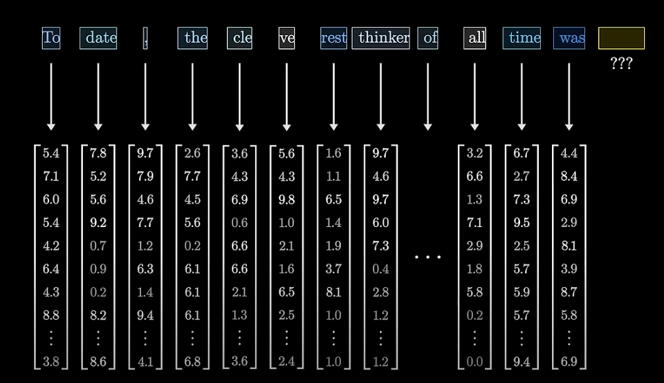
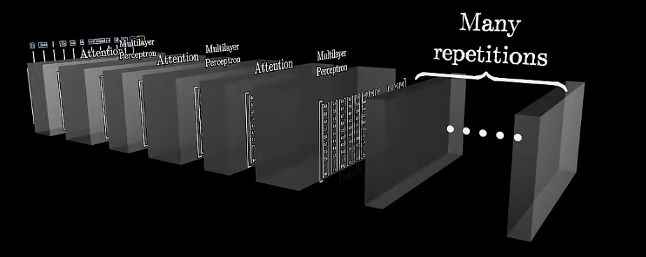
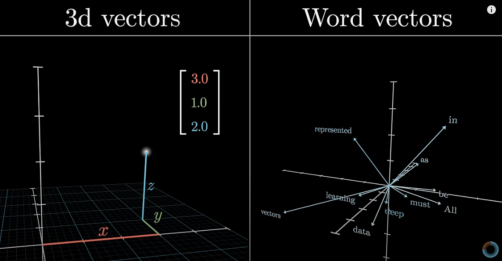
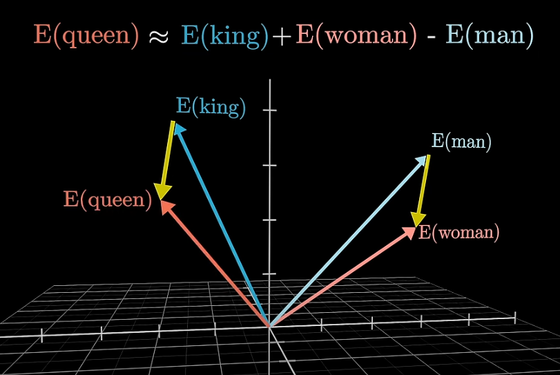
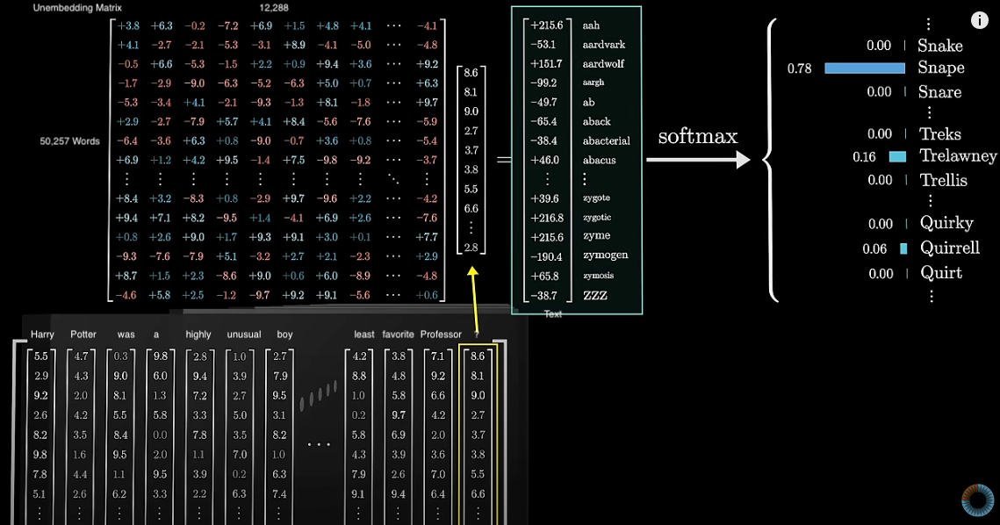
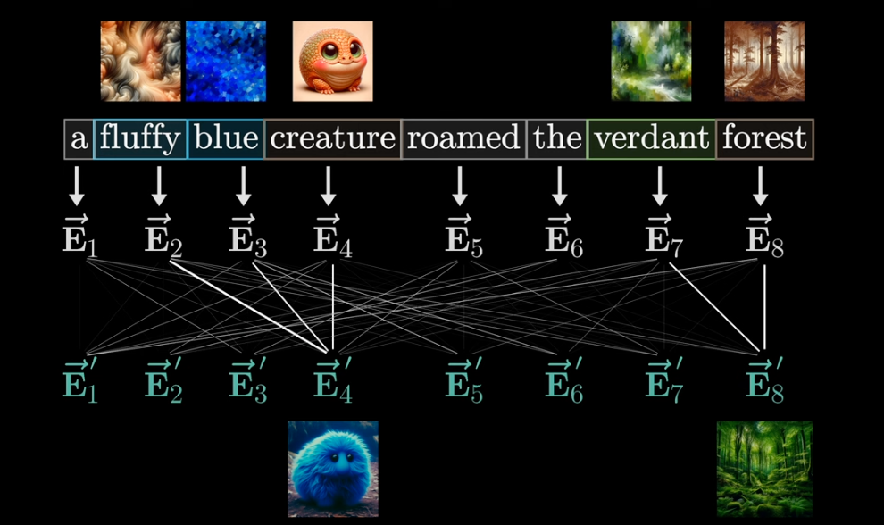
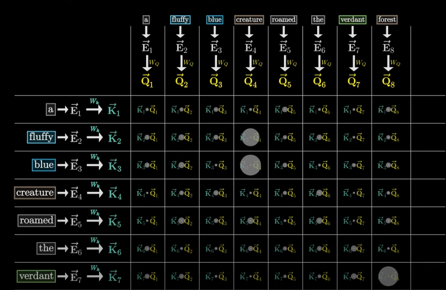
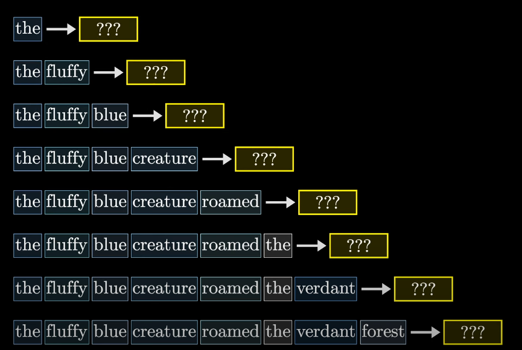
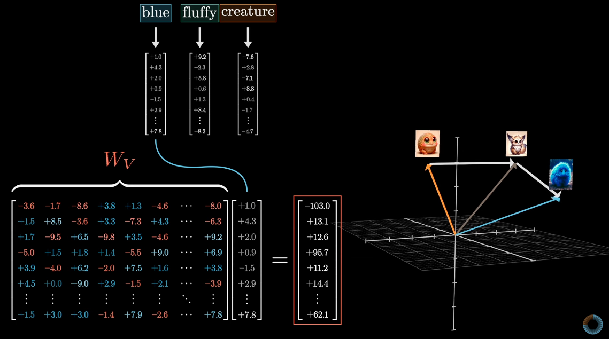

# Transformers

This notebook picks up after the Deep Learning guide and is a quick deep dive into transformer models and how they are trained. This is a learning resource, not a practitioners guide. All material is drawn from the 3Blue1Brown YoutTube Series on Deep Learning (videos 5-6). 

## Generative Pre-Trained Transformers (GPT)

Generative: Neural Networks that are able to generate text

Pre-Trained: Neural Network that is pre-trained on millions of text 

Transformer: A specific type of Neural Network

Transformers were invented by Google [(_Attention is All You Need_, 2017)](https://arxiv.org/abs/1706.03762) to translate text from one language to another. Now Transformers can do much more.

Let's consider a next-word prediction transformer, like GPT. 

Text (or images or audio) is broken into tokens, this can be full words or parts of words. Each token is then represented by a vector that encode the meaning of that token. Tokens that are similar have vectors that are closer together. 

This sequence of vectors is then passed to an **attention block** which allows vectors to "talk" to each other and pass meaning back and forth. For example, the word "model" surronded by words like "machine" and "learning" has a different meaning from the word "model" surronded by the word "fashion". The attention block is responsible for determining what words in the context is responsible for updating the meaning of our word "model" and how those meanings should be updated (the word vectors). We will return to this in more detail later.

These updated vectors are then passed to a **multilayer preceptron** (sometimes called a **feed-forward layer**) where vectors don't talk to each other but go through the same operation. We will come back to what this block does. 

This process is repeated until the final layer where we get some vector representation for the final word in our sequence we are trying to predict. We then take the probability distribution for this vector and return a token.

At a high level this is how chat bots work. 

## Tokenization and Semantic Meaning

Each transformer has a set vocabulary size, the number of tokens the model can know. Each words is embedded, assigning a vector representation of that word. In a model with a max positional embedding size of 12,288 and a vocabulary size of 50,257 (what GPT-3 uses) this means we have an array of 50,257 x 12,288.

The model adjust its weights to determine the position of all tokens, and as a result our word embeddings represent semantic meaning. This is how we get the classic example of King + Woman - Man = Queen. Why does this process lead to semantic meaning? Through training the model "learned" that one direction of our embedding represents gender (remember we are usually dealing with a large number of dimensions). Consider this example Hitler + Italy - Germany = Mussolini. Here the model learned that there is one direction for Italian-ness and one direction for World War II Axis leaders. Each dimension can represent different contextual meaning to our tokens.

As a result we can use the dot product of two vectors gives you a sense for how similar two vectors are, positive values indicate that two vectors are pointing in the same direction. 

Now if think back to the embedding matrix with 12,288 dimensions and vocabulary size of 50,257 this would mean the model has to learn 617,558,016 weights -- this is just one part of the weights the transformer model needs to learn.

The goal of a transformer model is to update these embeddings, using the alternating attention and multilayer perceptron layers, to take in the specific context of the words and produce embeddings that provide more meaning than what individual words alone can impart. After we have our embedding space defined, how does the model actually take in input data and produce a prediction?

## Unembedding

Most transformer models have a maximum context size, for GPT-3 this is 2,048. This is how much information the transformer can incorporate to achieve it's task, in this case predicting the next word. Once it learns the embeddings for our entire vocabulary, we can input data into this embedding space (2,048 x 12,288 matrix) and get a prediction. 

In the next word prediction example, first we get a vector representation of that final word. Then we compare this vector to our **unembedding** matrix of our vocabulary representations (embedding matrix transposed), normalize it using softmax function which returns a probability distribution over our vocabulary. 

The **softmax function** takes an vector of numbers (is this case the dot product of our prediction word vector and each word in our vacobulary) and changes these numbers to range from 0 to 1 with all values adding to 1.

Softmax has a tempature parameter $T$, which can take any value between 0 and 1. when $T$ is larger we give more weight to the lower values meaning the resulting distribution that is a bit more uniform; and when $T$ is smaller than the bigger values will dominate the distribution. If $T = 0$ then the largest value will have a probability of 1 and all others will be 0. 

You will often see the inputs into the softmax function described as logits and the outputs as probabilities.

## Attention

**Attention** is the mechanism by which a transformer learns what each token means depending on the context around it. Consider these three sentences:

1. American shrew mole 
2. One molde of carbon dioxide
3. Take a biopsy of the mole

In each sentence the meaning of mole is different, but the initial embedding will assign the same vector representation for the word mole in all three sentences. 

During the attention layer, the vectors of all our words are allowed to pass information to one another. The attention block determines what value needs to be added to the initial vector so that it's position is closer to its actual meaning within the context. 

The attention layers are tuning the model weights to minimize some cost function (see the Deep Learning Guide). But let's take a stylized example, consider the sentence "a fluffy blue creature roamed the verdant forest" -- we want fluffy and blue to update creature and verdant to update forest. 

In a single-head attention block we can imagine the noun creature asking the question "are there adjectives modifying me?" -- this question becomes a query vector $Q$ and is multipled by the embedding to produce a vector. Imagine there is some dimension of our embedding that captures nouns, this query vector will someone how encode looking for adjectives in other embedding positions. At the same time, the key matrix $K$ is multipled by the embedding and produces a key for each word and is like answers for the queries. So then the words fluffy and blue answer "yes I am". If we take the dot product between each key and query vector (and then normalize the dot product using softmax) we know how well each key matches each query.  

Now we have a sense for how closely related each token in a text is related to one another, and we call this normalized matrix the **attention pattern**.

$$ Attention(Q, K, V) = softmax({QK^T \over \sqrt{d_k}})V$$

* $Q$ and $K$ are the full arrays of query and key vectors, respectively 
* $QK^T$ is the dot product in the above image
* For math reasons, we divide this by the square root of the dimension of that key-query space $d$
* we apply softmax to each column of ${QK^T \over \sqrt{d_k}}$
* Then multiply this by the value matrix $V$ 

Right now you are probably wondering -- what is the training data in transformer models?
Transformer models, and specifically, the attention layer is training the embedding of each token to best predict the next word in the sequence. And it does this subsequent word in a single training example, so one example text acts as many training examples. 

We want the models attention (see what I did there) to focus on previous words and not subsequent words that might give away the answer. To do this we force the $K*Q$ vector between a token and it's subsequet tokens to always be 0 (so $K_{blue}$ x $Q_{fluffy} = 0$). Technically to do this we set that dot product to $-\infty$ so after softmax this value is 0. This is called **masking** -- not all transformer models do this, but many do. 

As a quick aside, the $QK^T$ matrix's size is equal to the _square_ of the context size, hence many models limit the context size and why increasing this value can be computationally intensive. In practice, we modify the $V$ to make it smaller and it gets fairly confusing from there, but implications are the same, larger context = more parameters = more resources. Some methods to work around this include:

1. Sparse Attention Mechanisms
2. Blockwise Attention
3. Linformer
4. Reformer
5. Ring Attention
6. Longformer 
7. Adaptive Attention Span

The attention pattern tells us what words are relevant to other words, now we need to update the embeddings. So we want the embedding of "fluffy" to change the embedding of "creature". In a single-head attention space we do this by creating a **value matrix** $V$, and multiply the value matrix by the vector for "fluffy" and add this resulting vector to the vector for "creature".

In practice this means only "a", "blue", and "fluffy" update "creature" -- recall how we zeroed out the weights for successive words. We do this for all words within our text and we have now completed a **single head of attention**. 

This process is called self-attention, but there are other transformer models that use cross-attention to process two distinct types of data such as data in one language and data in another language, or audio data and speech data. The cross attention is very similar, with the key difference being here the key and query maps to different data sets -- so for a translation model the keys might be a sentence in french and the queries might be that sentence in English, so the attention pattern tells you what words from one language correspond to what words in another language. In this setting, there would not be any masking since we aren't worried about later words affecting previous words. 

So far we have only discussed a single attention head using our adjective-noun example, but of course there are many elements of text that might influence the meaning. In practice, the query is not actually asking "are there adjectives modifying me?" (obviously). We don't actually know what the model is "asking" in order to update the weights, it is simply setting the weights, according to what words and in what order appear around a given token, in order to maximize the cost function. 

In practice, each attention block runs multi-headed attention in parallel, each with it's own distinct key-query-value maps. Chat GPT-3 uses 96 attention heads, creating 96 attention patterns, in each attention block. Within each attention block you then sum the proposed changes to each token vector from each attention block and add that to the original token embedding (does your head hurt yet?). By running these attention blocks in parallel we allow the model to learn the many ways context might affect meaning.

After we complete an attention block, the updated embeddings are fed to a multilater perceptron and the process repeats until we have a final embedding layer that is able to determine complex elements of natural language like meaning, tone, if it's a poem, who the text is about, and so on. 

## Multilayer Perceptron

More to come! 

## How Big Are Transformer Models

So how many parameters is our transformer model dealing with? Let's look at take GPT-3's parameters where we have . . .
* Vocabulary Size = 50,257
* Embedding Dimension = 12,288
* Query/Key Embedding Size = 128
* Attention Heads Per Block = 96
* Attention Layers = 96

| Matrix | Dimensions | Total Parameters|
| :------ | :---------------- | :---- |
| Embedding | $12,288 \times 50,257$ | $617,558,016$ |
| Key | $(128 \times 12,288) \times 96 \times 96$ | $14,495,514,624$ |
| Query | $(128 \times 12,288) \times 96 \times 96$  |  $14,495,514,624$ |
| Value-Up[^1] | $(128 \times 12,288) \times 96 \times 96$ | $14,495,514,624$ |
| Value-Down | $(12,288 \times 128) \times 96 \times 96$ | $14,495,514,624$ |
| Up-Projection[^2] | $(49,152 \times 12,288) \times 96$ | $57,982,058,496$ |
| Down-Projection | $(12,288\times 49,152) \times 96$ | $57,982,058,496$ |
| Unembedding | $50,257 \times 12,288$ | $617,558,016$ |
| **Total Weights** || **$175,181,291,520$** |

[^1]: The Value-Up and Value-Down matrices have to do with modifying the original value matrix to make it smaller and more computationally efficient. Feel free to research this if you want to know more. 
[^2]: These values come from the multilayer preceptron layers, more on that to come

## Helpful References
* [3Blue1Brown YoutTube Series on Deep Learning (Videos 5-6)](https://www.youtube.com/watch?v=wjZofJX0v4M)
* [Good Blog On Neural Networks](https://colah.github.io/)
* [Machine Learning Mastery](https://machinelearningmastery.com/)